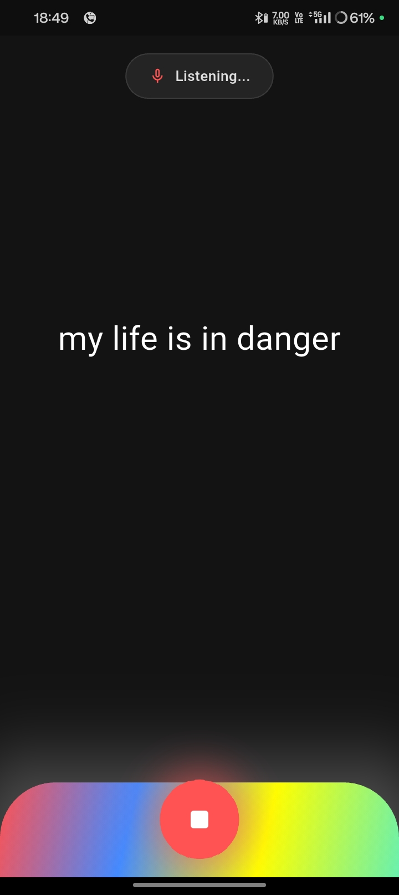
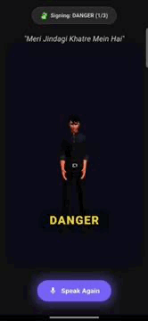
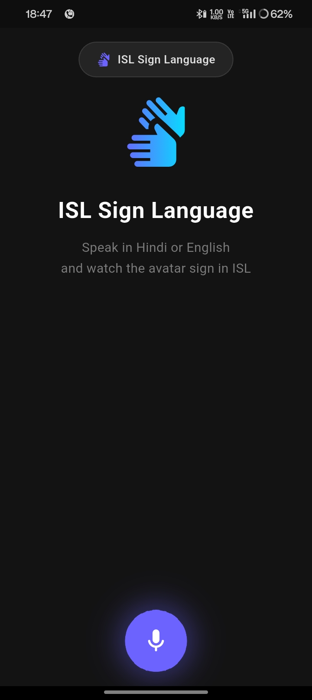

# 🧠 ISL Speech → Sign (Real-Time)

> 🎤 Voice → 🧠 ISL Grammar → 🤟 Gesture Output

Convert spoken Hindi/English into Indian Sign Language using NLP + 3D avatar using ISL grammar and official indian sign language videos.

---

## 🎥 Demo

  
  
  

---

## ⚡ What it does

- 🎤 Speech → Text (Hindi + English)
- 🧠 Converts to ISL grammar (not word-to-word)
- 🔄 Reorders into topic-comment structure
- 🤟 Generates gesture sequence
- 🧍 Animates 3D avatar in real-time

---
## 🏗️ Flow

  

---

## 🛠️ Tech

Flutter • FastAPI • n8n • OpenAI • Supabase • Three.js

---

## 👨‍💻 Contribution

Vikrant Saini (Me)- 
Flutter + Integration + UI + supabase + three.js + GLB (3d avatar).

Prathamesh Patil- N8N AI agent and NLP integration.

Abhishek Sapkal - Video Parsing using python parsing 3D model, with 99.9 % accuracy.

---

## ⚡ Note

⚡ Only 2 API calls → near real-time performance
